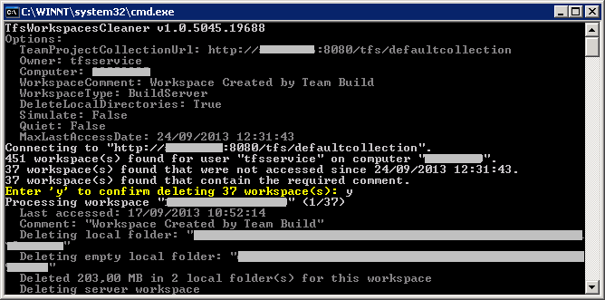
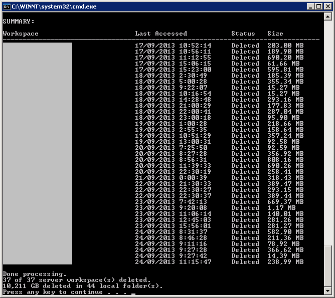

TFS Workspaces Cleaner deletes Team Foundation Server workspaces that have not been accessed in a number of days, along with their files locally on disk.

This is especially useful on build servers, where build definitions that have not run in a while can take up large amounts of disk space (which is not even cleaned up by build retention policies). Since it is a command-line tool, this cleanup can easily be automated as a Windows Scheduled Task.

## Usage
```
TfsWorkspacesCleaner /collection:url [/q] [/owner:owner] [/computer:computer]
                     [/inactivedays:days] [/log:logfile] [/simulate:true|false]
                     [/workspacetype:Workstation|BuildServer]
                     [/deletelocal:true|false] [/comment:comment]

  /collection    : The url for a Team Project Collection
  /q             : Quiet (do not prompt for confirmation)
  /owner         : The user name of the workspace owner
  /computer      : The name of the computer
  /inactivedays  : The number of days the workspace has not been accessed
  /log           : The log file name
  /simulate      : 'true' to simulate (does not delete anything)
  /workspacetype : 'Workstation' (default) only deletes the workspace files
                   'BuildServer' deletes sources and binaries on a build server
  /deletelocal   : 'false' to not delete local files, only the server workspace
  /comment       : If set, requires that workspaces contain this value in their
                   comment, e.g. 'Workspace created by Team Build' to avoid
                   deleting workspaces that were not created by a build server

During processing, press any key to pause or be able to cancel.
```

## Example
Use the following command to clean up workspaces that have not been used in the last 30 days on a build server (along with their local folders on disk):

```
TfsWorkspacesCleaner /collection:http://tfs:8080/tfs/defaultcollection
    /owner:tfsbuildservice /workspacetype:buildserver
    /comment:"Workspace created by Team Build"
    /inactivedays:30 /log:TfsWorkspacesCleaner.log
```

This could have the following result (note that cleaning many GB of space is not uncommon):


